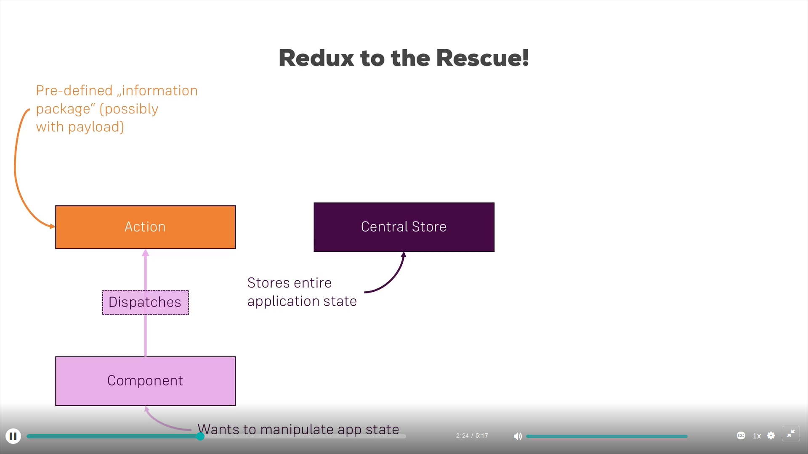
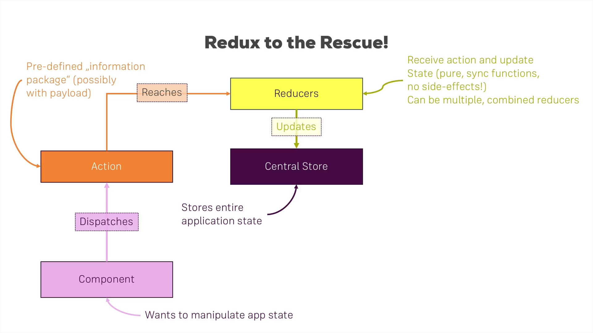
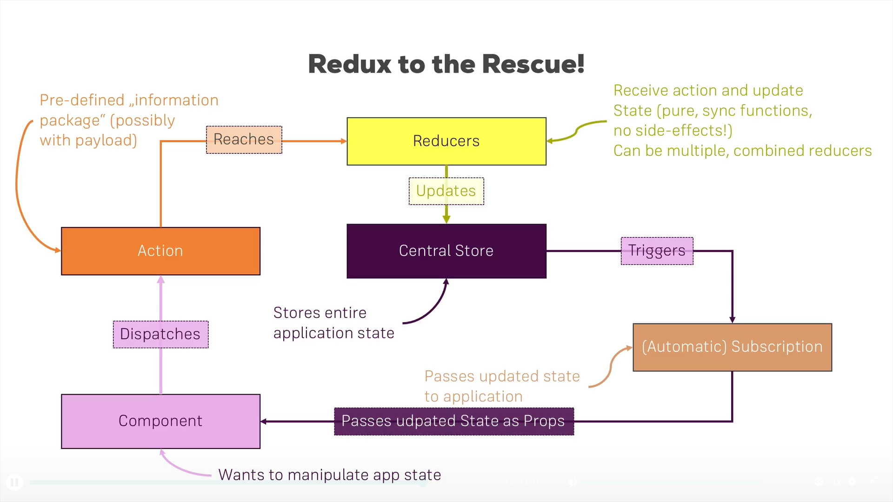

# Redux

## Key Services

- Centralize store for application state.
- Provides clearly defined and predictable ways to access and modify store content.

## Redux Actions

- Components that wants to modify data store dispatches an action, possibly with a data payload.



## Redux Reducers

- Action does not reach the store or modify it. Actions reach reducers.
- Multiple reducers are combined into a single root reducer.
- Each action has a type.
- Reducer takes in the current store and the action payload as input which could result in changes to the store.
- Reducer execute only synchronous code for predictable, synchronous changes to the store.
- It replaces the old store with a new JavaScript object of the updated store incorporating any state changes.
- This keep the store immutable at all times between store updates.



## Redux Store Update Notification

- Store changes are distributed via a publisher/subscriber model.
- The store triggers all subscribers when there is any change.
- React components subscribes to these store changes and receive updates automatically through property changes.



## Redux Key Parts

- Store: the redux application data store - a single, likely large, JavaScript object where all application states are contained.
- Reducer: each store as associated with a single reducer, a function with two inputs: (1) current store state, (2) action and returns a new store state (that could be the same or different from the old state). The code for this one reducer could be distributed to multiple JS script files that are combined into a single root reducer associated with a single store.
- Actions: each action is a JS object with a property named "type" that identifies a particular potential change to store data. Actions are dispatched to the reducer (along with the current store state) to determine if and how the store should change.
- Subscribers: subscribers are functions registered with the store that are called when the reducer has processed an action, whether the store state has changed or not.

## Setting up a Redux Store

- To set up a redux store, we need to have: (1) an initial state, (2) a reducer function.

```javascript
// Reducer/store needs to be initialized with some initial state.
const initialState = {
  counter: 0
};

// Minimum reducer that just returns current state with no change.
const rootReducer = (state = initialState, action) => {
  // Reducer needs to always return the state, whether changed or not.
  return state;
};

// Create new redux store
const store = createStore(rootReducer);
console.log("Initial state: ", store.getState());
```

## Subscribing to the Store

Subscribing to the score just means calling store.subscribe to register a function to be called when any action has completed.

```javascript
// Subscription gets automatic notification when the store is updated after an action has been processed by the reducer.
store.subscribe(() => {
  console.log("Subscription: ", store.getState());
});
```

## Dispatching Actions

Changes to the store are done by dispatching actions:

```javascript
// Action is dispatched by the store.dispatch function that takes
// an action object that has a "type" property which is just a
// unique identifier.  The convention is to use an all-uppercase
// string for "type" value.
store.dispatch({ type: "INC_COUNTER" });
store.dispatch({ type: "DO_NOTHING" });
store.dispatch({ type: "ADD_COUNTER", value: 10 });
```

Here is a sample reducer that processes the above actions:

```javascript
const rootReducer = (state = initialState, action) => {
  if (action.type === "INC_COUNTER") {
    return {
      ...state,
      counter: state.counter + 1
    };
  }
  if (action.type === "ADD_COUNTER") {
    return {
      ...state,
      counter: state.counter + action.value
    };
  }
  // Reducer needs to always return the state, whether changed or not.
  return state;
};
```

With the above reducer, the output from the subscription made earlier should be:

```
Subscription:  { counter: 1 }
Subscription:  { counter: 1 }
Subscription:  { counter: 11 }
```

## Using Redux with React

The "react-redux" module helps React code work with Redux.

The key react-redux elements are:

1. <Provider store=[...]/> component: Automatically subscribe all wrapped React components to the redux store specified in its "store" property.

Example use:

```javascript
// Subscribes <App /> and all children components to state
// changes in {store}
<Provider store={store}>
  <App />
</Provider>
```

2. connect function: Maps redux store states and action functions to be usable inside component properties for easy access.
